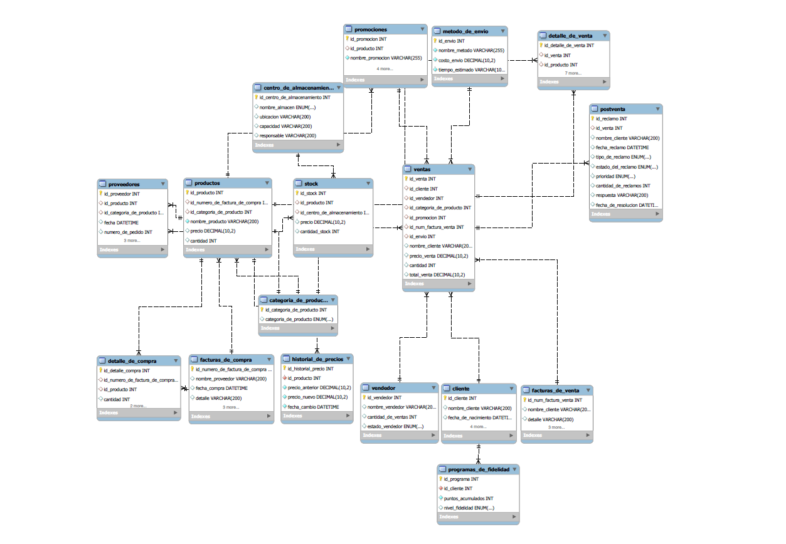

# PROYECTO: EL CUERVO PETSHOP

* Alumno: Patricia Laura Capitanelli,
* Curso: SQL,
* Comisión: 59430,
* Docente: Anderson Michel Torres, 
* Tutor: Hugo González.


# CONTENIDOS DE LA ENTREGA FINAL
* Documentación del modelo - El Cuervo PetShop
* Presentación en Canva
* Creación de la Base de Datos
* Características Principales
* Uso
* DER - Herramienta utilizada: Excalidraw
* Estructura del Proyecto
* Presentación en Canva


# **Documentación del modelo - El Cuervo PetShop**

Este proyecto está diseñado para gestionar las operaciones de ventas, compras y postventa de El Cuervo PetShop. El modelo permite almacenar y organizar información de clientes, proveedores, vendedores, productos, y reclamos postventa. Su estructura facilita la administración del inventario, la auditoría de transacciones, y el seguimiento de interacciones con clientes.


---

# **Presentación en Canva**
LINK: https://www.canva.com/design/DAGU3XvVhrI/LJ90pXHF-jiMnAlSKxnazw/edit?utm_content=DAGU3XvVhrI&utm_campaign=designshare&utm_medium=link2&utm_source=sharebutton

## **Creación de la Base de Datos**

```sql
DROP DATABASE IF EXISTS elcuervopetshop;
CREATE DATABASE elcuervopetshop;
USE elcuervopetshop;
```

## **Características Principales**

    Gestión de Ventas
Permite consultar y analizar las ventas realizadas con diversos filtros, como el tipo de venta (online o presencial) y rangos de cantidades vendidas.  

    Administración de Vendedores
Soporte para analizar el estado de los vendedores (activos o inactivos), su desempeño y la cantidad de ventas que han realizado.  

    Control de Productos y Clientes
Incluye herramientas para organizar y consultar información sobre productos y clientes asociados a las ventas.  

    Filtros Personalizable
Los procedimientos almacenados permiten realizar consultas específicas según los criterios seleccionados, como tipo de venta, estado del vendedor o rangos de cantidades.  

    Integración con MySQL
Diseñado para aprovechar las capacidades de los procedimientos almacenados, optimizando el acceso a la información y reduciendo la carga en las aplicaciones externas.


## **Uso**

    Consultas con Filtros
El sistema permite realizar consultas avanzadas a través de procedimientos almacenados que admiten filtros como:  
- Tipo de Venta**: Diferenciando entre ventas presenciales y ventas online.  
- Estado del Vendedor**: Para identificar si los vendedores están activos o inactivos.  
- Rangos de Cantidad Vendida**: Permite limitar las consultas a intervalos específicos de cantidades.  

    Análisis de Desempeño
El sistema proporciona herramientas para analizar datos clave sobre los vendedores y su desempeño, incluyendo la cantidad total de ventas realizadas.

    Control de Productos y Clientes
Organiza y consulta datos relevantes sobre los productos vendidos y los clientes asociados, proporcionando una visión integral de las operaciones.


## **DER - Herramienta utilizada: Excalidraw**



## **DER - Herramienta utilizada: MySQL**


## **Estructura del Proyecto**

El proyecto está organizado de la siguiente manera:  

- Base de Datos: Contiene los scripts necesarios para la creación y configuración de la base de datos, así como los procedimientos almacenados.  
- Documentación: Incluye el presente archivo README y otros recursos útiles, como diagramas de la base de datos (si están disponibles).  
- Scripts de Prueba: Contiene consultas de ejemplo para probar los procedimientos almacenados y verificar su funcionamiento.

## **TABLAS**
### Tabla: `proveedores`

**Propósito:** Registrar información sobre los proveedores.
Descripción: Almacena datos de los proveedores de productos.
Relaciones: Referencia productos y categoria_de_producto.
Problema que Resuelve: Centraliza los datos de proveedores para facilitar las compras y el seguimiento de pedidos.

| Campo                   | Tipo          | Descripción                                           |
| ----------------------- | ------------- | ------------------------------------------            |
| `id_proveedor`          | INT, PK       | Identificador único del proveedor.                    |
| `id_producto`           | INT, FK       | Producto suministrado por el proveedor.               |
| `id_categoria_de_producto` | INT, FK    | Categoría del producto.                               |
| `fecha`                 | DATETIME      | Fecha del registro o última actualización.            |    
| `numero_de_pedido`      | INT           | Número de pedido asociado.                            |
| `detalles`              | VARCHAR(200)  | Detalles del pedido o relación.                       |
| `forma_de_pago`         | ENUM          | Forma de pago pactada ("CONTADO", "A 30 DÍAS", etc.). |
| `estado_del_pago`       | ENUM          | Estado del pago ("PAGADO", "PENDIENTE"). |


### Tabla: `productos`

**Propósito:** Registrar los productos vendidos.
Descripción: Contiene información de cada producto, incluyendo su categoría, precio, y cantidad disponible.
Relaciones: Referencia facturas_de_compra y categoria_de_producto. Referenciado en detalle_de_compra, proveedores, stock, y detalle_de_venta.
Problema que Resuelve: Facilita el control y la actualización del inventario de productos, junto con la categorización y costos asociados.

| Campo                            | Tipo          | Descripción                           |
| -------------------------------- | ------------- | ------------------------------------- |
| `id_producto`                    | INT, PK       | Identificador único del producto.     |
| `id_numero_de_factura_de_compra` | INT, FK       | Referencia a `facturas_de_compra`.    |
| `id_categoria_de_producto`       | INT, FK       | Referencia a `categoria_de_producto`. |
| `nombre_producto`                | VARCHAR(200)  | Nombre del producto.                  |
| `precio`                         | DECIMAL(10,2) | Precio del producto.                  |
| `cantidad`                       | INT           | Cantidad disponible.    

### Tabla: `detalle_de_compra`

**Propósito:** Detallar los productos adquiridos en una compra.
Descripción: Almacena detalles de cada compra, incluyendo el producto, cantidad y subtotal.
Relaciones: Referencia productos y facturas_de_compra.
Problema que Resuelve: Proporciona un desglose detallado de las compras, permitiendo un control detallado de inventario y costos.

| Campo                       | Tipo          | Descripción                             |
| --------------------------- | ------------- | --------------------------------------- |
| `id_detalle_compra`         | INT, PK       | Identificador único del detalle.        |
| `id_numero_de_factura_de_compra` | INT, FK  | Referencia a `facturas_de_compra`.      |
| `id_producto`               | INT, FK       | Referencia al producto comprado.        |
| `cantidad`                  | INT           | Cantidad de producto comprado.          |
| `precio`                    | DECIMAL(10,2) | Precio unitario del producto.           |
| `subtotal`                  | DECIMAL(10,2) | Total por cantidad (cantidad * precio). |

### Tabla: `historial_de_precios`

**Propósito:** Registrar cambios en los precios de los productos.
Descripción: Almacena detalles de los precios a lo largo del tiempo.
Relaciones: Referenciada a la tabla de productos.
Problema que resuelve: Permite la trazabilidad del historial de precios en el periodo analizado.

| Campo              | Tipo          | Descripción                             |
| ------------------ | ------------- | --------------------------------------- |
| `id_historial_precio` | INT, PK    | Identificador único del registro.       |
| `id_producto`        | INT, FK     | Referencia al producto.                 |
| `precio_anterior`    | DECIMAL(10,2) | Precio anterior del producto.         |
| `precio_nuevo`       | DECIMAL(10,2) | Nuevo precio del producto.            |
| `fecha_cambio`       | DATETIME    | Fecha en que se realizó el cambio.      |


### Tabla: `facturas_de_compra`

**Propósito:** Registrar las facturas de compra realizadas a proveedores.
Descripción: Almacena detalles de las facturas de compra, incluyendo el proveedor, fecha de compra, monto bruto, impuestos y monto neto.
Relaciones: Referenciada en la tabla productos y detalle_de_compra.
Problema que Resuelve: Facilita el control y la auditoría de las compras realizadas, manteniendo un registro detallado de cada factura para gestionar costos y stock.

| Campo                            | Tipo          | Descripción                        |
| -------------------------------- | ------------- | ---------------------------------- |
| `id_numero_de_factura_de_compra` | INT, PK       | Identificador único de la factura. |
| `nombre_proveedor`               | VARCHAR(200)  | Nombre del proveedor.              |
| `fecha_compra`                   | DATETIME      | Fecha de la compra.                |
| `detalle`                        | VARCHAR(200)  | Detalle de la compra.              |
| `monto_bruto`                    | DECIMAL(10,2) | Monto bruto de la factura.         |
| `impuestos`                      | DECIMAL(10,2) | Impuestos aplicados.               |
| `monto_neto`                     | DECIMAL(10,2) | Monto neto (bruto + impuestos).    |


### Tabla: `categoria_de_producto`

**Propósito:** Clasificar los productos en diferentes categorías.
Descripción: Define las categorías de productos disponibles en la tienda.
Relaciones: Referenciado en productos, ventas, y proveedores.
Problema que Resuelve: Organiza los productos en categorías, facilitando la gestión del inventario y el análisis de ventas por categoría de producto.

| Campo                      | Tipo    | Descripción                          |
| -------------------------- | ------- | ------------------------------------ |
| `id_categoria_de_producto` | INT, PK | Identificador único de la categoría. |
| `categoria_de_producto`    | ENUM    | Categoría del producto.              |


### Tabla: `centro_de_almacenamiento`

**Propósito:** Registrar los centros de almacenamiento.
Descripción: Almacena información sobre los centros de almacenamiento.
Relaciones: Referenciado en la tabla stock.
Problema que Resuelve: Permite gestionar el inventario en diferentes ubicaciones de almacenamiento, optimizando la logística de stock.

| Campo                         | Tipo         | Descripción                      |
| ----------------------------- | ------------ | -------------------------------- |
| `id_centro_de_almacenamiento` | INT, PK      | Identificador único del almacén. |
| `nombre_almacen`              | ENUM         | Nombre del almacén.              |
| `ubicacion`                   | VARCHAR(200) | Ubicación del almacén.           |
| `capacidad`                   | VARCHAR(200) | Capacidad de almacenamiento.     |
| `responsable`                 | VARCHAR(200) | Responsable del almacén.         |


### Tabla: `stock`

**Propósito:** Gestionar la existencia de productos en los almacenes.
Descripción: Almacena información sobre la cantidad de productos disponibles en cada centro de almacenamiento.
Relaciones: Referencia productos y centro_de_almacenamiento.
Problema que Resuelve: Facilita la administración de los niveles de stock y permite rastrear la ubicación de productos en los distintos centros de almacenamiento.

| Campo                      | Tipo          | Descripción                             |
| ---------------------------| ------------- | --------------------------------------- |
| `id_stock`                 | INT, PK       | Identificador único del stock.           |
| `id_producto`              | INT, FK       | Referencia al producto.                  |
| `id_centro_de_almacenamiento` | INT, FK    | Referencia al centro de almacenamiento.  |
| `precio`                   | DECIMAL(10,2) | Precio del producto en este stock.       |
| `cantidad_stock`           | INT           | Cantidad de unidades disponibles.        |

### Tabla: `ventas`

**Propósito:** Registrar las ventas realizadas.
Descripción: Registra cada venta realizada, incluyendo el cliente, vendedor, producto y el monto total.
Relaciones: Referencia cliente, vendedor, categoria_de_producto, y facturas_de_venta.
Problema que Resuelve: Permite llevar un control detallado de las ventas, identificando el cliente y el vendedor asociados, así como la categoría del producto.

| Campo                   | Tipo          | Descripción                              |
| ----------------------- | ------------- | ---------------------------------------- |
| `id_venta`              | INT, PK       | Identificador único de la venta.         |
| `id_cliente`            | INT, FK       | Cliente que realizó la compra.           |
| `id_vendedor`           | INT, FK       | Vendedor asociado a la venta.            |
| `id_categoria_de_producto` | INT, FK    | Categoría de los productos vendidos.     |
| `id_num_factura_venta`  | INT, FK       | Referencia a la factura de venta.        |
| `nombre_cliente`        | VARCHAR(200)  | Nombre del cliente.                      |
| `precio_venta`          | DECIMAL(10,2) | Precio total de los productos vendidos.  |
| `cantidad`              | INT           | Cantidad total de productos vendidos.    |
| `total_venta`           | DECIMAL(10,2) | Total de la venta (precio * cantidad).   |


### Tabla: `vendedor`

**Propósito:** Gestionar la información de los vendedores.
Descripción: Almacena la información sobre los vendedores, incluyendo nombre, estado y cantidad de ventas.
Relaciones: Referenciado en la tabla ventas.
Problema que Resuelve: Ayuda a gestionar y evaluar el desempeño de cada vendedor individualmente y permite segmentar las ventas realizadas por cada uno.

| Campo                | Tipo         | Descripción                                 |
| -------------------- | ------------ | ------------------------------------------- |
| `id_vendedor`        | INT, PK      | Identificador único del vendedor.           |
| `nombre_vendedor`    | VARCHAR(200) | Nombre del vendedor.                        |
| `cantidad_de_ventas` | INT          | Cantidad de ventas realizadas.              |
| `estado_vendedor`    | ENUM         | Estado del vendedor ("ACTIVO", "INACTIVO"). |

### Tabla: `cliente`

**Propósito:** Registrar los clientes de la tienda.
Descripción: Almacena los datos de los clientes, como nombre, fecha de nacimiento, dirección, email, estado del cliente, etc.
Relaciones: Referenciado en la tabla ventas.
Problema que Resuelve: Permite mantener un historial y una clasificación de los clientes basada en su estado, facilitando el seguimiento y la fidelización de clientes.

| Campo                 | Tipo         | Descripción                                |
| --------------------- | ------------ | ------------------------------------------ |
| `id_cliente`          | INT, PK      | Identificador único del cliente.           |
| `nombre_cliente`      | VARCHAR(200) | Nombre del cliente.                        |
| `fecha_de_nacimiento` | DATETIME     | Fecha de nacimiento.                       |
| `direccion`           | VARCHAR(200) | Dirección del cliente.                     |
| `email`               | VARCHAR(200) | Correo electrónico (único).                |
| `fecha_de_alta`       | DATETIME     | Fecha de registro como cliente.            |
| `estado`              | ENUM         | Estado del cliente ("DEUDOR", "A TIEMPO"). |

### Tabla: `facturas_de_venta`

**Propósito:** Registrar las facturas de venta emitidas.
Descripción: Almacena las facturas de venta generadas para cada transacción.
Relaciones: Referenciado en la tabla ventas.
Problema que Resuelve: Facilita el registro y la verificación de ventas realizadas, proporcionando un control administrativo.

| Campo                  | Tipo          | Descripción                        |
| ---------------------- | ------------- | ---------------------------------- |
| `id_num_factura_venta` | INT, PK       | Identificador único de la factura. |
| `nombre_cliente`       | VARCHAR(200)  | Nombre del cliente.                |
| `detalle`              | VARCHAR(200)  | Detalle de la venta.               |
| `monto_bruto`          | DECIMAL(10,2) | Monto bruto de la factura.         |
| `impuestos`            | DECIMAL(10,2) | Impuestos aplicados.               |
| `monto_neto`           | DECIMAL(10,2) | Monto neto (bruto + impuestos).    |

### Tabla: `programas_de_fidelidad`
| Campo                     | Tipo          | Descripción                              |
| -----------------------   | ------------- | ---------------------------------------- |
| `id_programa`             | INT, PK       | Identificador único del programa.        |
| `id_cliente`              | INT, FK       | Relación con la tabla clientes.          |
| `puntos_acumulados`       | INT,          | Puntos acumulados por el cliente.        |
| `nivel_fidelidad`         | ENUM,         | Nivel del cliente (básico, premium, VIP).|

### Tabla: `promociones`

**Propósito:** Gestionar promociones y descuentos.

| Campo                  | Tipo         | Descripción                          |
| ---------------------- | ------------ | ------------------------------------ |
| `id_promocion`         | INT, PK      | Identificador único de la promoción. |
| `nombre_promocion`     | VARCHAR(255) | Nombre de la promoción.              |
| `descripcion`          | TEXT         | Descripción de la promoción.         |
| `fecha_inicio`         | DATETIME     | Fecha de inicio de la promoción.     |
| `fecha_fin`            | DATETIME     | Fecha de fin de la promoción.        |
| `porcentaje_descuento` | DECIMAL(5,2) | Porcentaje de descuento aplicado.    |

### Tabla: `metodo_de_envio`

**Propósito:** Registrar los métodos de envío disponibles.

| Campo             | Tipo          | Descripción                              |
| ----------------- | ------------- | ---------------------------------------- |
| `id_envio`        | INT, PK       | Identificador único del método de envío. |
| `nombre_metodo`   | VARCHAR(255)  | Nombre del método de envío.              |
| `costo_envio`     | DECIMAL(10,2) | Costo del envío.                         |
| `tiempo_estimado` | VARCHAR(100)  | Tiempo estimado de entrega.              |


### Tabla: `detalle_de_venta`

**Propósito:** Detallar los productos vendidos en cada venta.
Descripción: Almacena detalles de los productos vendidos en cada transacción.
Relaciones: Referencia ventas, productos, y facturas_de_venta.
Problema que Resuelve: Ofrece un desglose detallado de cada venta, permitiendo analizar las ventas por producto y tipo de venta (online o física).

| Campo                   | Tipo          | Descripción                              |
| ----------------------- | ------------- | ---------------------------------------- |
| `id_detalle_de_venta`   | INT, PK       | Identificador único del detalle.         |
| `id_venta`              | INT, FK       | Referencia a la venta asociada.          |
| `id_producto`           | INT, FK       | Referencia al producto vendido.          |
| `id_num_factura_venta`  | INT, FK       | Referencia a la factura de venta.        |
| `cantidad`              | INT           | Cantidad de unidades vendidas.           |
| `precio`                | DECIMAL(10,2) | Precio unitario del producto.            |
| `descuento`             | DECIMAL(10,2) | Descuento aplicado al producto.          |
| `subtotal`              | DECIMAL(10,2) | Total por producto (cantidad * precio).  |
| `tipo_venta`            | ENUM          | Tipo de venta ("ONLINE", "FÍSICA").      |
| `nombre_cliente`        | VARCHAR(200)  | Nombre

### Tabla: `postventa`

**Propósito:** Gestionar los reclamos realizados por los clientes.
Descripción: Almacena información sobre reclamos de postventa.
Relaciones: Referencia ventas.
Problema que Resuelve: Facilita el seguimiento y la gestión de los reclamos para mejorar el servicio postventa.

| Campo                | Tipo          | Descripción                                            |
| -------------------- | ------------- | ------------------------------------------             |
| `id_reclamo`         | INT, PK       | Identificador único del reclamo.                       |
| `id_venta`           | INT, FK       | Referencia a la venta asociada.                        |
| `nombre_cliente`     | VARCHAR(200)  | Nombre del cliente.                                    |
| `fecha_reclamo`      | DATETIME      | Fecha en que se realizó el reclamo.                    |
| `tipo_de_reclamo`    | ENUM          | Tipo de reclamo ("PRODUCTO DEFECTUOSO", etc.).         |
| `estado_del_reclamo` | ENUM          | Estado del reclamo ("RESUELTO", "EN PROGRESO", etc.).  |
| `prioridad`          | ENUM          | Prioridad del reclamo ("ALTA", "MEDIA", "BAJA").       |
| `cantidad_de_reclamos` | INT         | Número de reclamos realizados por el cliente.          |
| `respuesta`          | VARCHAR(200)  | Respuesta proporcionada al cliente.                    |
| `fecha_de_resolucion` | DATETIME     | Fecha en que se resolvió el reclamo.                   |


## **VISTAS**

## 1. **Vista: Total de Ingresos por Categoría**

### Propósito
Esta vista muestra los ingresos totales generados por cada categoría de producto, el número de ventas y el valor promedio de las transacciones.

### Tablas Relacionadas
- **ventas**: Proporciona la información sobre las transacciones realizadas.
- **categoria_de_producto**: Contiene las categorías de productos y sus descripciones.

### Atributos Generados
- `categoria_de_producto`: Nombre de la categoría.
- `total_ingresos`: Suma total de las ventas por categoría.
- `num_ventas`: Cantidad total de ventas por categoría.
- `promedio_transaccion_valor`: Valor promedio de las transacciones.

### Relación
- **ventas** (N) → **categoria_de_producto** (1) mediante `id_categoria_de_producto`.

---

## 2. **Vista: Crecimiento de Ventas Mensuales**

### Propósito
Analiza el crecimiento mensual de las ventas, calculando el incremento porcentual entre meses consecutivos.

### Tablas Relacionadas
- **ventas**: Registra el total de ventas y las fechas correspondientes.
- **cliente**: Relaciona a las ventas con los clientes.

### Atributos Generados
- `year`: Año de la venta.
- `month`: Mes de la venta.
- `total_mensual_ventas`: Total de ventas mensuales.
- `previa_mensuales_ventas`: Total de ventas del mes anterior.
- `crecimiento_porcentual`: Porcentaje de crecimiento comparado con el mes previo.

### Relación
- **ventas** (N) → **cliente** (1) mediante `id_cliente`.

---

## 3. **Vista: Análisis de Retención de Clientes**

### Propósito
Calcula la tasa de retención de clientes según su actividad y estado.

### Tablas Relacionadas
- **cliente**: Registra los clientes y su estado.
- **ventas**: Identifica las transacciones realizadas por cada cliente.

### Atributos Generados
- `estado_cliente`: Estado actual del cliente.
- `total_clientes`: Cantidad total de clientes.
- `clientes_activos`: Clientes que han realizado al menos una compra.
- `tasa_retencion`: Porcentaje de clientes activos sobre el total.

### Relación
- **cliente** (1) ← **ventas** (N) mediante `id_cliente` (LEFT JOIN).

---

## 4. **Vista: Desempeño del Vendedor**

### Propósito
Analiza el desempeño de los vendedores basándose en el total de ventas realizadas y sus valores promedio.

### Tablas Relacionadas
- **vendedor**: Registra los datos y el estado de los vendedores.
- **ventas**: Relaciona las transacciones con los vendedores responsables.

### Atributos Generados
- `nombre_vendedor`: Nombre del vendedor.
- `estado_vendedor`: Estado actual del vendedor.
- `cantidad_de_ventas`: Cantidad total de ventas realizadas.
- `total_ventas`: Suma total de las ventas realizadas.
- `promedio_valor_ventas`: Promedio de valor por transacción.
- `num_ventas`: Total de transacciones únicas.

### Relación
- **ventas** (N) → **vendedor** (1) mediante `id_vendedor`.

---

## 5. **Vista: Análisis de Quejas**

### Propósito
Proporciona un resumen del tipo y estado de los reclamos realizados, su porcentaje y el tiempo promedio de resolución.

### Tablas Relacionadas
- **postventa**: Registra los reclamos de los clientes, sus estados y fechas.

### Atributos Generados
- `tipo_de_reclamo`: Clasificación del reclamo.
- `estado_del_reclamo`: Estado actual del reclamo.
- `total_reclamos`: Cantidad total de reclamos registrados.
- `porcentajes_reclamos`: Porcentaje del total de reclamos por tipo.
- `promedio_resolucion_tiempo`: Días promedio para resolver los reclamos.

### Relación
- **postventa** (N) → **ventas** (1) mediante `id_venta`.

---

## 6. **Vista: Rotación de Inventarios**

### Propósito
Evalúa la rotación de los productos en el inventario comparando las unidades vendidas con el stock actual.

### Tablas Relacionadas
- **productos**: Proporciona información de los productos.
- **stock**: Contiene datos del inventario actual.
- **categoria_de_producto**: Clasifica los productos en categorías.
- **detalle_de_venta**: Relaciona las ventas con los productos.

### Atributos Generados
- `nombre_producto`: Nombre del producto.
- `categoria_de_producto`: Categoría del producto.
- `stock_actual`: Cantidad de unidades disponibles en inventario.
- `total_unidades_vendidas`: Cantidad total de unidades vendidas.
- `tasa_rotacion`: Relación entre unidades vendidas y el stock actual.

### Relación
- **productos** (1) → **stock** (1) mediante `id_producto`.
- **productos** (1) → **categoria_de_producto** (1) mediante `id_categoria_de_producto`.
- **productos** (1) → **detalle_de_venta** (N) mediante `id_producto`.


## **FUNCIONES**

## 1. **Función: Verificar Disponibilidad de un Producto**
- **Descripción**: La función `verificar_disponibilidad_producto` se utiliza para comprobar si un producto tiene suficiente stock disponible para satisfacer una cantidad deseada.
- **Relación en el DER**:
  - Tabla **stock**: La función consulta el atributo `cantidad_stock` usando `id_producto` como clave de búsqueda.
- **Resultado**: Devuelve un mensaje indicando si el stock es suficiente o insuficiente, junto con el stock disponible.

---

## 2. **Función: Tiempo Promedio de Resolución de Reclamos**
- **Descripción**: La función `tiempo_promedio_resolucion_reclamos` calcula el tiempo promedio (en días) que tarda en resolverse un reclamo marcado como "RESUELTO".
- **Relación en el DER**:
  - Tabla **postventa**: Utiliza los atributos `fecha_de_resolucion`, `fecha_reclamo` y `estado_del_reclamo` para calcular la diferencia de días.
- **Resultado**: Devuelve un número decimal representando el tiempo promedio de resolución en días.

---

## 3. **Función: Tasa de Retención del Cliente**
- **Descripción**: La función `calcular_tasa_retencion_clientes` calcula el porcentaje de clientes activos (con al menos una venta) en relación con el total de clientes registrados.
- **Relación en el DER**:
  - Tabla **cliente**: Se consulta el número total de clientes (`id_cliente`).
  - Tabla **ventas**: Se determina el número de clientes activos a partir de las ventas asociadas.
- **Resultado**: Devuelve un valor decimal indicando el porcentaje de retención de clientes.

---

## 4. **Función: Vendedor con Mayor Cantidad de Ventas**
- **Descripción**: La función `vendedor_top_ventas` obtiene el nombre del vendedor con la mayor cantidad de ventas ejecutadas.
- **Relación en el DER**:
  - Tabla **vendedor**: Se consulta el atributo `cantidad_de_ventas` y se ordenan los registros para obtener al vendedor con más ventas.
- **Resultado**: Devuelve el nombre del vendedor con el mayor número de ventas.

---

## **PROCEDIMIENTOS**
1. InsertarProducto
Descripción: Permite registrar un nuevo producto en la base de datos.
Parámetros de entrada:
p_id_factura_compra: Identificador de la factura de compra asociada.
p_id_categoria: Identificador de la categoría del producto.
p_nombre_producto: Nombre del producto.
p_precio: Precio del producto.
p_cantidad: Cantidad inicial de stock del producto.
Relaciones:
Inserta datos en la tabla productos.
Se relaciona con facturas_de_compra y categoria_de_producto mediante claves foráneas.
2. RegistrarVenta
Descripción: Registra una nueva venta y genera la factura correspondiente.
Parámetros de entrada:
p_id_cliente: Identificador del cliente.
p_id_vendedor: Identificador del vendedor.
p_id_categoria: Identificador de la categoría del producto.
p_nombre_cliente: Nombre del cliente.
p_precio_venta: Precio unitario del producto vendido.
p_cantidad: Cantidad vendida.
Relaciones:
Inserta datos en las tablas facturas_de_venta y ventas.
Relaciona ventas con cliente, vendedor y categoria_de_producto mediante claves foráneas.
3. RegistrarReclamo
Descripción: Registra un nuevo reclamo en el sistema postventa.
Parámetros de entrada:
p_id_venta: Identificador de la venta asociada al reclamo.
p_nombre_cliente: Nombre del cliente.
p_tipo_reclamo: Tipo de reclamo (enum: PRODUCTO DEFECTUOSO, RETRASO EN ENTREGA, etc.).
p_prioridad: Prioridad del reclamo (enum: ALTA, MEDIA, BAJA).
p_respuesta: Respuesta inicial al reclamo.
Relaciones:
Inserta datos en la tabla postventa.
Relaciona postventa con ventas.
4. ActualizarStock
Descripción: Actualiza el stock de un producto en el almacén correspondiente.
Parámetros de entrada:
p_id_producto: Identificador del producto.
p_id_centro_almacenamiento: Identificador del centro de almacenamiento.
p_cantidad: Cantidad a añadir al stock.
Relaciones:
Actualiza o inserta datos en la tabla stock.
Sincroniza el stock de la tabla productos.
5. ObtenerDetallesVentaConVendedoresFiltrados
Descripción: Recupera detalles de ventas con filtros avanzados sobre el tipo de venta, estado del vendedor y rangos de cantidad.
Parámetros de entrada:
p_tipo_venta: Tipo de venta a filtrar (opcional).
p_estado_vendedor: Estado del vendedor a filtrar (opcional).
p_min_cantidad: Cantidad mínima de productos vendidos (por defecto: 0).
p_max_cantidad: Cantidad máxima de productos vendidos (por defecto: 1,000,000).
Relaciones:
Consulta las tablas detalle_de_venta, ventas, y vendedor.
Permite análisis con múltiples criterios.

## **TRIGGERS**

## **USUARIOS**


### Como levantar el proyecto en CodeSpaces GitHub
            env: Archivo con contraseñas y data secretas
            Makefile: Abstracción de creacción del proyecto
            docker-compose.yml: Permite generar las bases de datos en forma de contenedores
### Pasos para arrancar el proyecto
            En la terminal de linux escribir :
            make si te da un error de que no conexion al socket, volver al correr el comando make
            make clean-db limpiar la base de datos
            make test-db para mirar los datos de cada tabla
            make backup-db para realizar un backup de mi base de datos
            make access-db para acceder a la base de datos

[def]: image.png